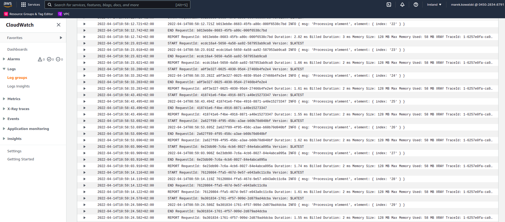

# Motivation

Let's say you need to iterate over huge dataset and perform a piece of work for each record.
Let's assume that you need to limit how fast you iterate. It may be because you rely on calls
to external service and number of requests per day are capped. Or maybe you just need to care
about how much resources you use and not make denial service attack on yourself ;)

## Pseudocode

For those who prefer reading code than text, this is how we would naively solve this problem.

```typescript
  const someDelay = 10 * 1000;

  async function doSomeWork(record: Record): Promise<void> {
    console.log("We're doing work on record")
  }

  async function iterate(records: Record[]): Promise<void> {
    for (const record of records) {
      await retryWithExponentialBackoff(doSomeWork, record);
      await new Promise(resolve => { setTimeout(resolve, someDelay) });
    }
  }
```

## Problem

Essentialy code above does what we need, but now we would like to call it over a dataset that's
really big? How big you ask. Let's say it will take about 2 months to finish if we account for
number of records and that we need to go slow (1 record every 10 seconds).

How to do this naively? We could use launch an EC2 instance and launch a script like the one above
on it. It's not our prefered solution because:

* We would have to pay for it. This would cost, say $50 for some small instance running 24/7
for 2 months.

* We would like to be able to fix mistakes (bugs, unwanted features, unclear requirements ;))
in our script while it's doing it's work. Ideally in a way, that if it gets stuck for some reason,
we would like the ability to update the code and have it resume the iteration where it left of.

# Solution

AWS has a very nice feature that's a very good fit for this solving this problem - Step Functions.

Using it we would like to create a graph that looks like this:


The complete code of this example can be found in `template.yml` file in this repository.
The source of execution flow above is as follows

```yaml
      Definition:
        StartAt: GetElementCount
        States:
          GetElementCount:
            Type: Task
            Resource: !GetAtt InitIterator.Arn
            ResultPath: "$.iterator"
            Next: CheckIfFinished
          CheckIfFinished:
            Type: Choice
            Choices:
              -
                Variable: "$.iterator.continue"
                BooleanEquals: true
                Next: ProcessElement
            Default: Done
          ProcessElement:
            Type: Task
            Resource: !GetAtt ProcessElement.Arn
            ResultPath: "$.iterator"
            Next: WaitABit
            Retry:
              - ErrorEquals:
                  - States.TaskFailed
                IntervalSeconds: 3
                MaxAttempts: 65535
                BackoffRate: 1.5
          WaitABit:
            Type: Wait
            Seconds: 10
            Next: CheckIfFinished
          Done:
            Type: Succeed

```


It uses two lambda function. First function prepares the iterator object that we will be passing
along and which will control our process of iteration. It looks like:

```javascript
  exports.handler = (event, context, callback) => {
    console.log(event);
    callback(null, {
      count: event.collection.length,
      index: 0,
      continue: event.collection.length > 0
    });
  };
```

Idea here is that as long as `$.iterator.continue` is true the iteration will keep on going.

Second function is the one actually doing the job. It looks as follows:

```yavascript
  exports.handler = (event, context, callback) => {
    const element = event.collection[event.iterator.index];
    console.log({ msg: 'Processing element', element });
    callback(null, {
      count: event.iterator.count,
      index: event.iterator.index + 1,
      continue: event.iterator.index < event.iterator.count,
    });
  };
```
You can do whatever processing you wish in here. As long as this function return udpated state of
iterator you're good to go.

It's important to note, that if this function raises and exception, it's configured to keep on
trying until it passes. This part of configuration (template.yml) is responsible for this behavior:

```yaml
      Retry:
        - ErrorEquals:
            - States.TaskFailed
          IntervalSeconds: 3
          MaxAttempts: 65535
          BackoffRate: 1.5
```

If you reach an element that, for some reason, you can't process, you can update the code,
redeploy and it will continue the iteration using the new code.

## Testing

### Deploy

You have sam-cli (https://github.com/aws/aws-sam-cli) installed and console access to your
AWS account configured.

To deploy this example on your account use:

```
make deploy
```

It will print out the ARN of state machine to the console.

Also, use same function if you've made any modification to the code and want to update it on AWS.


### Launch exection

I have a local file under path `/tmp/input.json` with a structure like:

```
{ collection: Array<any }
```

I can pass this file for iteration using:

```bash
aws stepfunctions start-execution
  --state-machine-arn $STATE_MACHINE_ANR
  --input file:///tmp/input.json
```

## Monitoring

Each execution you start you will see on the list in AWS console, like this:


When you go inside, you will see the details:


It's important to note that you can expand each entry on the list and see it's input and output.
Give it a try!

Finally you can see the logs from our the lambda doing the processing in Cloud Watch. It looks like
this:



## Take aways

### Costs

It's important to point out few important aspects of this solution.
From logs in Cloud Watch we can see that it's actually one execution envrinment that is doing
all the processing. So we have a long-living node.js process, so whatever we cache in memory we
can use between the iteration cycles. The kicker is that AWS bills us only for the execution
time of the iteration and not for the time we wait between the iterations.

So we can have a cookie, eat the cookie, and not have to pay for it ;)

### Passing collection between steps

A careful observer will notice that in this example we are passing entire collection in parameters
of the processing function and only select the record to process inside the processing function.
This is just a simplification and obviously not the right way to proceed if you are iteration over say
500k records.
The only important bit in processing is the `iterator` object. We usually keep the collection we
iterate over in some database. It's not important which database is you favorite.
I didn't want to introduce to much infrastracture to this example for simplicity sake!

## Nice resources

When working with with Step Functions it's exteremely helpful to use Simulator:
https://us-east-1.console.aws.amazon.com/states/home?region=us-east-1#/simulator


It's very helpful in understanding how data flow through the state machine and what values to put in
* InputPath

* OutputPath

* ResultPath

* Parameters
